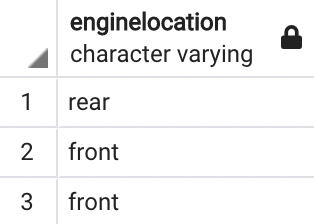

## *Still working on this page...* 

### Real-world situation

You are working with a local used car dealership. The dealership owner wants to know which cars customers are most likely to purchase so that they know what to keep in stock. From an external source, you obtain a data set that contains historical sales data on car prices and their related features: CarPrice_Assignment. You think these features can be used to give the dealership owner a list of the top popular cars and trims, and help determine which cars should be in the inventory.

The goal of this project is to clean the data. Analyzing bad data could cause the business owner to reach the wrong conclusions and, ultimately, lose money.

## Inspect the data

According to the [data description](https://archive.ics.uci.edu/ml/datasets/Automobile), `fueltype` should contain only two unique string values: diesel and gas. For this reason, this column should be inspected by checking its unique values. 

```javascript
SELECT 
  DISTINCT (fueltype)
FROM 
  public.car_data
```


Since these values agree with the values in the data description, I can verify that the data in the `fueltype` column is already clean.

According to the [data description](https://archive.ics.uci.edu/ml/datasets/Automobile), the `length` column values should range from 141.1 to 208.1. I will make the following query containing the `MIN()` and `MAX()` functions to inspect the minimum and maximum values of this column:

```javascript
SELECT 
  MIN(carlength) AS min_length,
  MAX(carlength) AS max_length
FROM public.car_data
```


Again the results in this column is clean.

### Fill in missing data

Missing values in data can distort analysis results. One way to inspect a column for missing values in SQL is to use the `IS NULL` condition.

```javascript
SELECT * 
FROM public.car_data
WHERE doornumber IS null;
```


A couple of values are missing in the `doornumber` column. One BMW and one Honda with sedan body styles. 

Next I make a query to pull up BMW with matching attributes:

```javascript
SELECT*
FROM 
  public.car_data
WHERE 
  carname LIKE 'bmw%' 
  AND fueltype = 'gas'
  AND aspiration = 'std'
  AND carbody = 'sedan'
ORDER BY 1;
```


I notice that there is also another BMW 320i with similar features. However, after doing additional research I can safely conclude that the missing value here should be four. 

To make the replacement, I make a query using the `UPDATE` statement:

```javascript
UPDATE 
  public.car_data
SET
  doornumber = 'four'
WHERE
  "car_ID" = '12'
```

To verify that the missing value was filled in correctly, I made the same query previously and the results appeared like this:


Now I repeat the same process for the Honda.

## Identify potential mistakes in the data

Using the `DISTINCT` statement I check for erroneous data that can distort results.

```javascript 
SELECT
  DISTINCT(cylindernumber)
FROM
  public.car_data;
```


I find that there are written values of numbers, and one of those number values is misspelled. 

Using a similar query used above I fix the misspelled value. Result looks like this:


The `cylindernumber` column is now clean.


Some values include numbers in a range. I make a query to inspect the `peakrpm` column

```javascript
SELECT 
  MIN(peakrpm) AS min_peakrpm, 
  MAX(peakrpm) AS max_peakrpm
FROM public.car_data
```
Results look like this:


Sometimes values can be out of range. According to the data description, the `peakrpm` column values should have a range from 4150 to 6600.

I will make a query to see if other values in this column are in range
```javascript

SELECT 
  peakrpm
FROM 
  public.car_data
ORDER BY 
 peakrpm ASC;
```

Other results are in range. To gain more insight on that specific error I query:

```javascript
SELECT
  *
FROM
  cars.car_info
WHERE
 peakrpm = 520;
```


One result is returned. After doing additional research I can conclude that the correct number should be 5200. In SQL I will use the `UPDATE` statement fix the existing record in a table.

```javascript
SELECT 
  peakrpm
FROM 
  public.car_data
ORDER BY 
 peakrpm ASC;

```

I recheck to see if the erroneous value was fixed correctly. The `peakrpm` column is now clean.


## Ensuring that the data is consistent

Discrepancies can create inaccurate, unreliable results. This leads to misinformed business decisions.

I will use the `DISTINCT` statement to check for data inconsistencies in enginelocation



These values appear to agree. However, front appears twice. This is most likely happening because some front values include extra spaces. I will use the `LENGTH` function to understand this:

```javascript
SELECT  
  LENGTH (enginelocation) AS length_enginelocation
FROM 
  public.car_data
GROUP BY 
  enginelocation;
```

The SQL `LENGTH` function identified an inconsistent point, front had 6 characters when there should only be 5. To fix this I remove the leading space from this string. I will use the `TRIM` function to remove the space.

```javascript
UPDATE 
  public.car_data
SET
  enginelocation = TRIM (enginelocation)
WHERE 
  LENGTH (enginelocation) > 5;

```


I verify if the space was removed with a query and get these results


Now this column is clean.


## Conclusion

Working with clean data will insure that investors make good decisions about their stock. 

